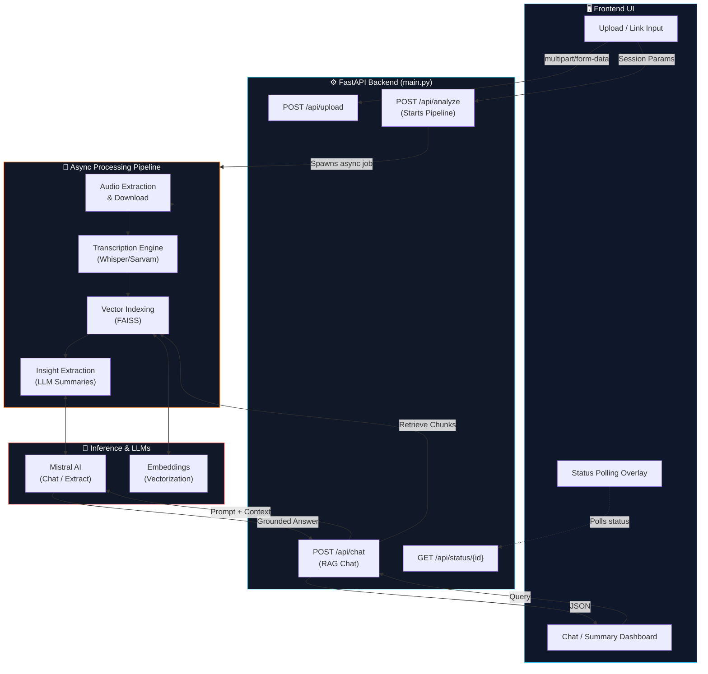
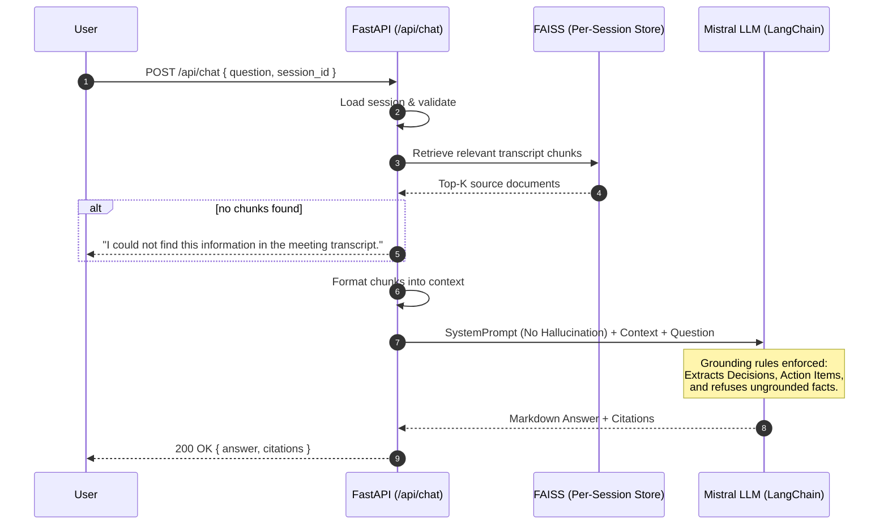

<div align="center">


# VisionNote AI

### Cinematic Video Intelligence & Meeting RAG Engine

**Upload audio/video or a YouTube link — get a full transcript, executive summary, and chat with your media using Retrieval-Augmented Generation (RAG).**

[](https://www.python.org/)
[](https://fastapi.tiangolo.com/)
[](https://www.langchain.com/)
[](https://openai.com/research/whisper)
[](https://mistral.ai/)
[](https://github.com/facebookresearch/faiss)
[](#license)

</div>

---

## 📖 Table of Contents

1. [Overview](#-overview)
2. [System Architecture](#-system-architecture)
3. [The RAG Pipeline — Deep Dive](#-the-rag-pipeline--deep-dive)
4. [Backend API Reference](#-backend-api-reference)
5. [Project Structure](#-project-structure)
6. [Tech Stack](#-tech-stack)
7. [Getting Started](#-getting-started)
8. [License](#-license)

---

## 🌟 Overview

**VisionNote AI** is an enterprise-grade AI Meeting Intelligence Assistant. Users can upload media files (audio/video) or provide a YouTube URL. The backend orchestrates a complex async pipeline to transcribe the media (via Whisper/Sarvam), index the transcript into a per-session FAISS vector store, and extract key insights (action items, decisions, summaries). Finally, it allows users to chat seamlessly with their video through an evidence-based, hallucination-free RAG engine powered by Mistral and LangChain.

This project is built around a robust, asynchronous **FastAPI backend** that drives the intelligence, while a sleek frontend provides the cinematic UX.

---

## 🏛️ System Architecture

The architecture relies on a highly decoupled async pipeline ensuring seamless user experience even for large video files.



---

## 🔍 The RAG Pipeline — Deep Dive

The **chat with your video** feature uses strict, evidence-based prompt engineering to prevent hallucinations. The AI acts as a professional business analyst.



### RAG Highlights
- **Per-Session Retrievers**: FAISS vector stores are isolated per session. No cross-user or cross-meeting data leakage.
- **Citation Extraction**: Source chunks are preserved and returned to the frontend.
- **Evidence-Only System Prompt**: The system is explicitly instructed to output *"I could not find this information"* if the context doesn't support the answer.

---

## 🔌 Backend API Reference

The FastAPI backend exposes the following core routes (interactive docs at `http://localhost:8000/docs`):

| Method | Endpoint | Description |
|---|---|---|
| `POST` | `/api/upload` | Streams media to disk, returns `upload_id` |
| `POST` | `/api/analyze` | Kicks off the async processing pipeline (returns `202 Accepted`) |
| `GET` | `/api/status/{id}` | Polls pipeline progress for the frontend overlay |
| `GET` | `/api/summary/{id}` | Retrieves the final generated title and markdown summary |
| `POST` | `/api/chat` | The RAG Chat interface (`{ question, session_id }` → `{ answer, citations }`) |
| `GET` | `/api/extract/{id}/{kind}`| Fetches specific insights (e.g., `action_items`, `decisions`) |
| `GET` | `/api/health` | Liveness probe and config validation warnings |

---

## 📂 Project Structure

```text
VisionNote Ai/
├── backend/
│   ├── main.py                  # FastAPI entrypoint, HTTP routes
│   ├── requirements.txt         # Python dependencies
│   ├── app/
│   │   ├── config.py            # Environment configurations
│   │   ├── core/                # Core logic (audio, extractor, rag_engine, vector_store)
│   │   ├── schemas.py           # Pydantic models & validation
│   │   └── services/            # Pipeline orchestrator and session store
│   ├── uploads/                 # Temporary storage for uploaded media
│   └── vector_db/               # FAISS indices stored per session
├── Fronted/
│   ├── index.html               # Cinematic UI
│   └── js/                      # Frontend API integration
└── screenshots/
    └── Screenshot 2026-09-13 191116.png
```

---

## 🚀 Tech Stack

- **Backend Framework:** [FastAPI](https://fastapi.tiangolo.com/) (Async Python)
- **AI Orchestration:** [LangChain](https://www.langchain.com/)
- **Large Language Model:** [Mistral AI](https://mistral.ai/)
- **Transcription:** OpenAI Whisper / Sarvam
- **Vector Database:** [FAISS](https://github.com/facebookresearch/faiss) (Local, rapid similarity search)
- **Frontend:** Vanilla HTML/JS with high-end cinematic CSS

---

## 🛠️ Getting Started

### Prerequisites
- Python 3.11+
- API Keys for Mistral (and transcription services if required)

### Setup Instructions

1. **Navigate to the backend**
   ```bash
   cd backend
   ```

2. **Create a virtual environment & install dependencies**
   ```bash
   python -m venv .venv
   source .venv/bin/activate  # On Windows: .venv\Scripts\activate
   pip install -r requirements.txt
   ```

3. **Configure Environment**
   Copy `.env.example` to `.env` and fill in your API keys.
   ```bash
   cp .env.example .env
   ```

4. **Run the Development Server**
   ```bash
   uvicorn main:app --reload --port 8000
   ```

The backend is now running at **`http://localhost:8000`**. You can explore the API documentation at **`http://localhost:8000/docs`**.

---

## 📄 License

Distributed under the MIT License.
